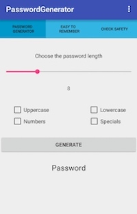

# seminar-project-lomoz

"PasswordGenerator" is an android application which generates safe passwords from the user's preferences.
It also generates passwords, which are easy to remember, but are safe as well.
The third function is safety check for existing passwords.

Dokumentation: "Lorcan Mozis, 2234829, lomoz.pdf"

Installation und Benutzung der App:

1. APK „PasswordGenerator.apk“ auf das Zielgerät downloaden.
2. APK installieren.
3. Eventuell „unbekannte Quellen“ in den Einstellungen aktivieren.
4. App ausführen.
