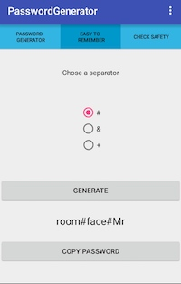

#PasswordGenerator

"PasswordGenerator" is an android application which generates safe passwords from the user's preferences.
It also generates passwords, which are easy to remember, but are safe as well.
The third function is safety check for existing passwords.

This is the normal password generator with the default settings.

This is an example for a new generated password. The user now has the option to copy the password to the clipboard with a button click.

This is the default screen for the passwords, which are easy to remember.

This is an example for a new generated "easy-to-remember" password. The user has the option to copy the password to the clipboard the same way it works for normal passwords.

This is another example for an easy to remember password with another separator.

This is the safety check for existing passwords.

This is the options menu.

##Installation

The application's apk-file is named "PasswordGenerator.apk"
To run the App you can use an android smartphone or an android emulator.

###Installation on a smartphone

1. Download "PasswordGenerator.apk" on your device
2. Install the APK
3. Possibly "unknown sources" has to be activated in the settings
4. Start the Application

###Instalaltion on an emulator

For windows and Mac OS you can use 
[Andy](http://www.andyroid.net) is an emulator for windows and Mac OS. It's possible to install apks there, which are visualized in a virtual box afterwards.
The installation will most probably follow the same rules as the smartphone istallation.

##Development

###Developed with:

The IDE [Android Studio](https://developer.android.com/studio/index.html) 2.1+ was the main tool to develope the app. 
Android Studio is based on IntelliJ by [JetBrains](https://www.jetbrains.com) and is the official IDE of Google for android apps.

###Developed from:

Lorcan Mozis

##Dokumentation

Filename: "Lorcan Mozis, 2234829, lomoz.pdf"

